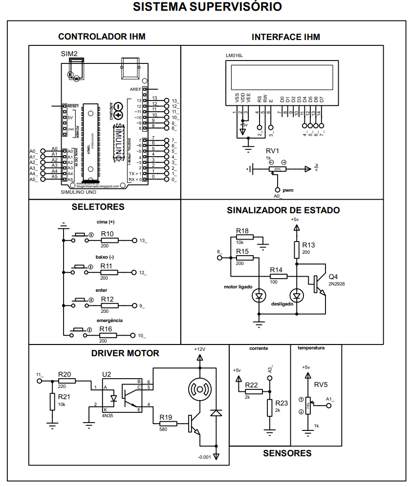
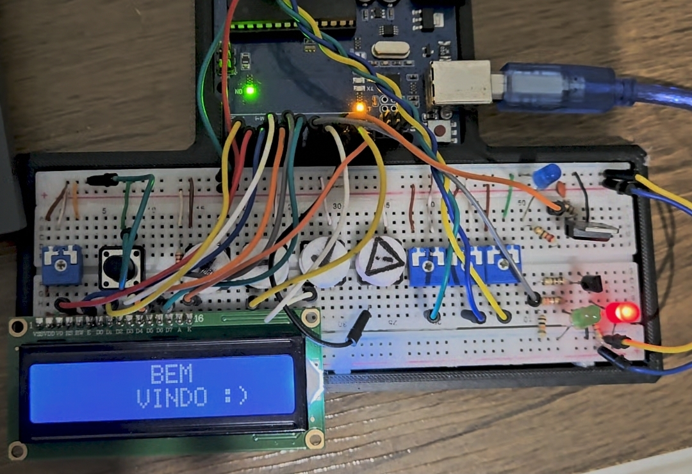

<h1 align="center">Sistema Supervisório de Motores – ATmega328P (Assembly)</h1>

<em>Projeto didático de sistemas embarcados com ATmega328P, desenvolvido em Assembly para estudo avançado de microcontroladores e controle de motores elétricos.</em>

---

<strong>Observação:</strong> Este projeto ainda está em desenvolvimento. A versão mais recente contém alguns bugs na programação, mas o sistema já funcionou corretamente em testes anteriores e foi bem avaliado.

---

<h2>Sumário</h2>
<ul>
  <li><a href="#descrição-técnica">Descrição Técnica</a></li>
  <li><a href="#funcionalidades-do-projeto">Funcionalidades do Projeto</a></li>
  <li><a href="#modos-de-operação">Modos de Operação</a></li>
  <li><a href="#arquitetura-do-sistema">Arquitetura do Sistema</a></li>
  <li><a href="#funcionalidades-do-atmega328p">Funcionalidades do ATmega328P</a></li>
  <li><a href="#estrutura-dos-arquivos">Estrutura dos Arquivos</a></li>
  <li><a href="#esquemas-eletrônicos">Esquemas Eletrônicos</a></li>
  <li><a href="#projeto-montado">Projeto Montado</a></li>
  <li><a href="#exemplos-visuais">Exemplos Visuais</a></li>
  <li><a href="#como-executar">Como Executar</a></li>
  <li><a href="#licença">Licença</a></li>
</ul>

<h2 id="descrição-técnica">Descrição Técnica</h2>

Este projeto é puramente didático, criado para consolidar conhecimento da disciplina de microcontroladores no curso de Engenharia Mecatrônica.

O sistema implementa um controle supervisório de motor elétrico, com:

<ul>
  <li>Monitoramento em tempo real de temperatura, corrente e rotação do motor;</li>
  <li>Proteção automática por desligamento quando parâmetros críticos são atingidos;</li>
  <li>Menus interativos para configuração de limites, soft start e armazenamento de parâmetros;</li>
  <li>Programação em Assembly explorando a arquitetura interna do ATmega328P, incluindo timers, ADC, PWM, UART, EEPROM e multiplexação de pinos.</li>
</ul>

---

<h2 id="funcionalidades-do-projeto">Funcionalidades do Projeto</h2>
<ul>
  <li>Monitoramento de temperatura, corrente e rotação do motor em tempo real.</li>
  <li>Desligamento automático ao atingir níveis críticos.</li>
  <li>Configuração de parâmetros via menus interativos: limites, tempo de rampa, frequência PWM.</li>
  <li>Implementação de soft start para controle gradual do motor.</li>
  <li>Armazenamento de parâmetros em memória interna para persistência entre reinicializações.</li>
</ul>

---

<h2 id="modos-de-operação">Modos de Operação</h2>

<h4>Menu Principal</h4>
<ul>
  <li>Modo normal de operação</li>
  <li>Modo normal com soft start</li>
  <li>Modo salvar parâmetros</li>
</ul>

<h4>Modo Normal</h4>
<ul>
  <li>Definir limite de temperatura</li>
  <li>Definir limite de corrente</li>
  <li>Definir frequência do PWM</li>
</ul>

<h4>Modo Normal com Soft Start</h4>
<ul>
  <li>Definir tempo de rampa</li>
  <li>Definir PWM máximo da rampa</li>
</ul>

<h4>Menu Salvar Parâmetros</h4>
<ul>
  <li>Definir valores de parâmetros a serem salvos</li>
  <li>Selecionar local de memória (EEPROM)</li>
</ul>

<h4>Exemplo de Código do Menu</h4>
<pre>
; Lógica de navegação do menu
state_escolha:
    sbis pinb, btn_baixo
    rcall debounce_baixo
    sbis pinb, btn_cima
    rcall debounce_cima
    sbis pinb, btn_enter
    rcall state_enter
    rjmp state_escolha
</pre>

---

<h2 id="arquitetura-do-sistema">Arquitetura do Sistema</h2>
<ul>
  <li>Microcontrolador: ATmega328P</li>
  <li>Sensores: Temperatura e corrente analógicos</li>
  <li>Controle: PWM para acionamento do motor</li>
  <li>Interface: Display LCD 16x2 para menus e status do sistema</li>
  <li>Software: Programação em Assembly com timers, ADC, UART, EEPROM e multiplexação de pinos</li>
</ul>

---

<h2 id="funcionalidades-do-atmega328p">Funcionalidades do ATmega328P</h2>
<ul>
  <li>Display LCD 16x2: Exibe menus, parâmetros e status em tempo real.</li>
  <li>Menus configuráveis: Permite alterações de valores críticos (tempo, limites, PWM).</li>
  <li>Temporização com interrupções: Uso de Timers 0, 1 e 2 para soft start, PWM e leitura periódica de sensores.</li>
  <li>Saída PWM: Controle de velocidade do motor e soft start.</li>
  <li>Leitura analógica (ADC): Sensores de corrente, temperatura e potenciómetros.</li>
  <li>Entradas analógicas com potenciómetros: Ajuste manual de parâmetros.</li>
  <li>Comunicação UART (Serial): Impressão de etapas do processo e status do sistema.</li>
  <li>EEPROM: Registro persistente de ajustes e parâmetros.</li>
  <li>Multiplexação de pinos: Otimização do uso de portas do microcontrolador para múltiplas funções simultâneas.</li>
</ul>

---

<h2 id="estrutura-dos-arquivos">Estrutura dos Arquivos</h2>

O projeto está organizado da seguinte forma:

<ul>
  <li><strong>main.asm</strong>: arquivo principal do firmware em Assembly. <a href="Trabalho_microcontroladores_2/main.asm">Clique aqui para acessar</a></li>
  <li><strong>.pdsprj</strong>: arquivos de projeto do Proteus para simulação do circuito eletrônico.</li>
  <li><strong>Trabalho_microcontroladores_2/</strong>: pasta com o projeto completo do Atmel Studio, incluindo arquivos de configuração, código e compilados.</li>
</ul>

---

<h2 id="esquemas-eletrônicos">Esquemas Eletrônicos</h2>

Simulação do circuito no Proteus e diagramas de ligação:

  

    <h4>Diagrama do Circuito Principal</h4>
    
  

---

<h2 id="projeto-montado">Projeto Montado</h2>

  

Sistema montado com ATmega328P, sensores de corrente/temperatura, motor de teste e display LCD funcionando na prática.

---

<h2 id="exemplos-visuais">Exemplos Visuais</h2>

  

    <h4>Simulação no Proteus</h4>
    
  

---

<h2 id="como-executar">Como Executar</h2>
<ol>
  <li>Conecte o microcontrolador ATmega328P ao motor e sensores.</li>
  <li>Compile e carregue o firmware em Assembly usando AVR Studio ou Atmel Studio.</li>
  <li>Ligue o sistema e navegue pelos menus no display LCD.</li>
  <li>Ajuste limites de temperatura, corrente e parâmetros PWM conforme necessário.</li>
  <li>Teste a funcionalidade de soft start e desligamento automático.</li>
</ol>

---

<h2 id="licença">Licença</h2>

Projeto didático, aberto para estudo e aprendizado, sem fins comerciais. Sinta-se livre para modificar e explorar para fins acadêmicos.

Desenvolvido para Engenharia Mecatrônica com foco em controle de motores, leitura de sensores e programação de microcontroladores de baixo nível.

